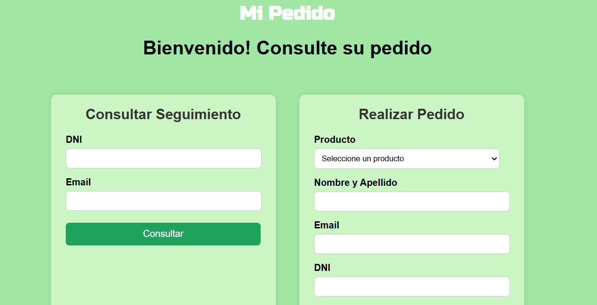
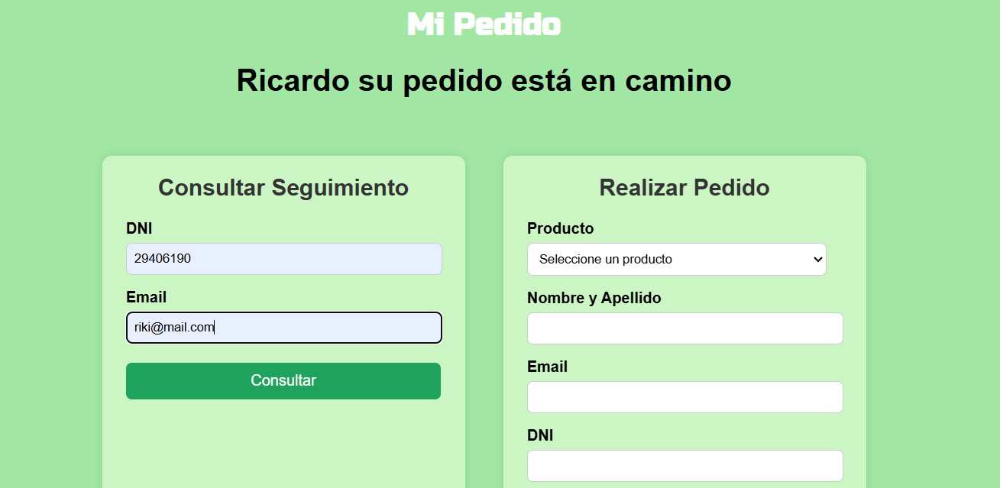

# Mi Pedido
#### Página web para seguimiento y creación de pedidos en línea

Proyecto académico del curso Introducción a la programación en PHP 2. El mismo utiliza las tecnologías PHP, HTML y Mysql para generar la aplicación, una página web con conexión a base de datos.

Para ejecutar el código
- clonar el repositorio
- mover el proyecto a la carpeta xampp - htdocs
- iniciar el servidor apache y mysql de xampp
- importar el script tpintegrador.sql para generar la base de datos
- ir a localhost/<nombre del proyecto>

